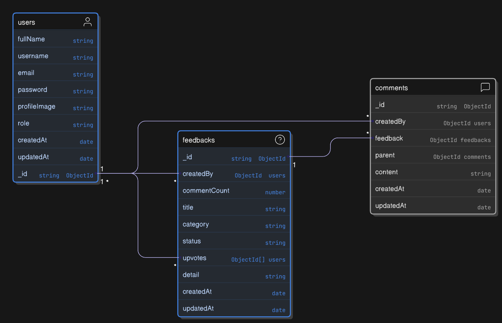

# Product Feedback app

This is a solution to the [Product feedback app challenge on Frontend Mentor](https://www.frontendmentor.io/challenges/personal-finance-app-JfjtZgyMt1)

## Features

- 👤 User Authentication & profile update
- 🛡️ Admin Controls (Official Replies, Update Status, Censor Feedback)
- ➕ Create, Edit, Delete product feedback Requests
- 👍 Upvote & Sort feedbacks by Votes/Comments
- 🏷️ Filter suggestions by Category
- 💬 Comment & Reply (Threaded Conversations)
- 📊 Roadmap Tracking (Planned, In Progress, Live)

## stack

- **UI:** [React](https://react.dev/)
- **Backend framework:** [Fastify](https://fastify.dev/)
- **Database:** [Mongodb](https://www.mongodb.com/)
- **ORM:** [Mongoose](https://mongoosejs.com/)
- **Global state management:** [Redux Toolkit](https://redux-toolkit.js.org/)
- **Asynchronous states management:** [RTK query](https://redux-toolkit.js.org/rtk-query/overview)

## Database Design

## License

Licensed under the MIT License. Check the [LICENSE](./LICENSE.md) file for details.
