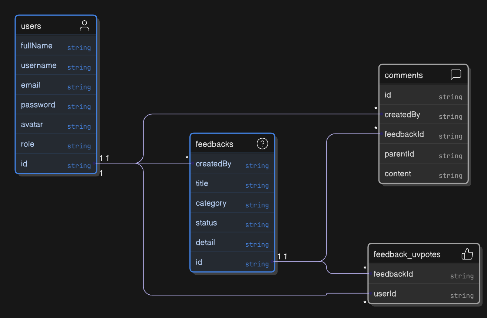

# Product Feedback app

This is a solution to the [Product feedback app challenge on Frontend Mentor](https://www.frontendmentor.io/challenges/product-feedback-app-wbvUYqjR6)

## Features

- 👤 User Authentication & profile update
- 🛡️ Admin Controls (Official Replies, Update Status)
- ➕ Create, Edit, Delete product feedback Requests
- 👍 Upvote & Sort feedbacks by Votes/Comments
- 🏷️ Filter suggestions by Category
- 💬 Comment & Reply (Threaded Conversations)
- 📊 Roadmap Tracking with Kanban view for admins (Planned, In Progress, Live)

## stack

- **UI:** [React](https://react.dev/)
- **Backend framework:** [Fastify](https://fastify.dev/)
- **Database:** [Postgresql](https://www.postgresql.org/)
- **ORM:** [Drizzle ORM](https://orm.drizzle.team/)
- **Global state management:** [Redux Toolkit](https://redux-toolkit.js.org/)
- **Asynchronous states management:** [RTK query](https://redux-toolkit.js.org/rtk-query/overview)

## Database Design



## Running locally

1. Clone repository

   ```bash
   git clone git@github.com:Raphico/product-feedback-app.git
   cd product-feedback-app
   ```

2. Install dependencies

   ```bash
   yarn install
   ```

3. Setup environmental variables (see `.env.example`)

4. Start database container

   ```bash
   docker compose -f docker-compose.dev.yml up --build
   ```

5. Run database migrations

   ```bash
   yarn workspace @product-feedback-app/server db:migrate
   ```

6. start development servers

   ```bash
   yarn dev
   ```

## License

Licensed under the MIT License. Check the [LICENSE](./LICENSE.md) file for details.
